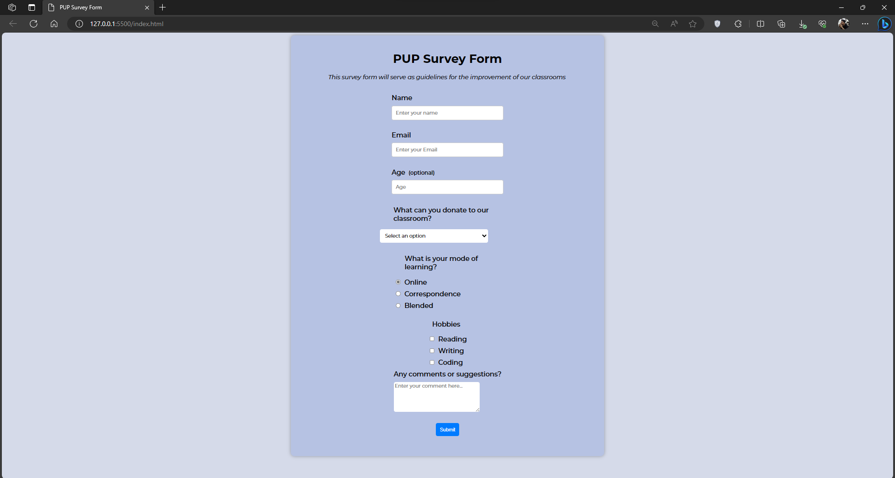

# Survey Form
The purpose of this repo is to monitor my progress in learning HTML by making a basic [Survey Form](https://www.freecodecamp.org/learn/2022/responsive-web-design/#build-a-survey-form-project).

## Screenshots

## Learnings
1. I've learned that I need to make more projects to understand the syntax both in html and css
2. I've learned that I need to practice more in order to make my code more readable and understandable